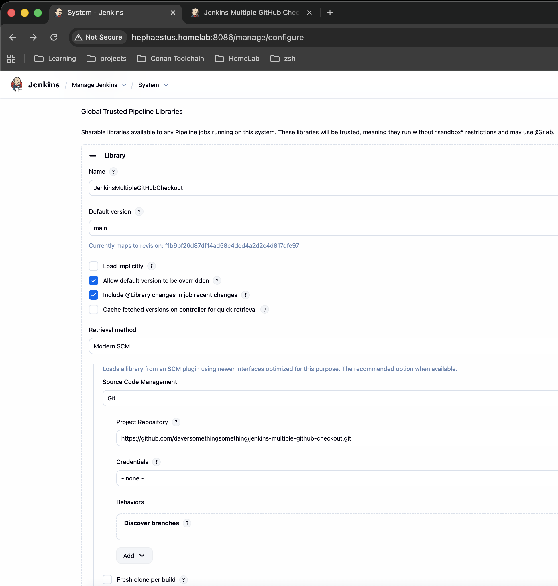
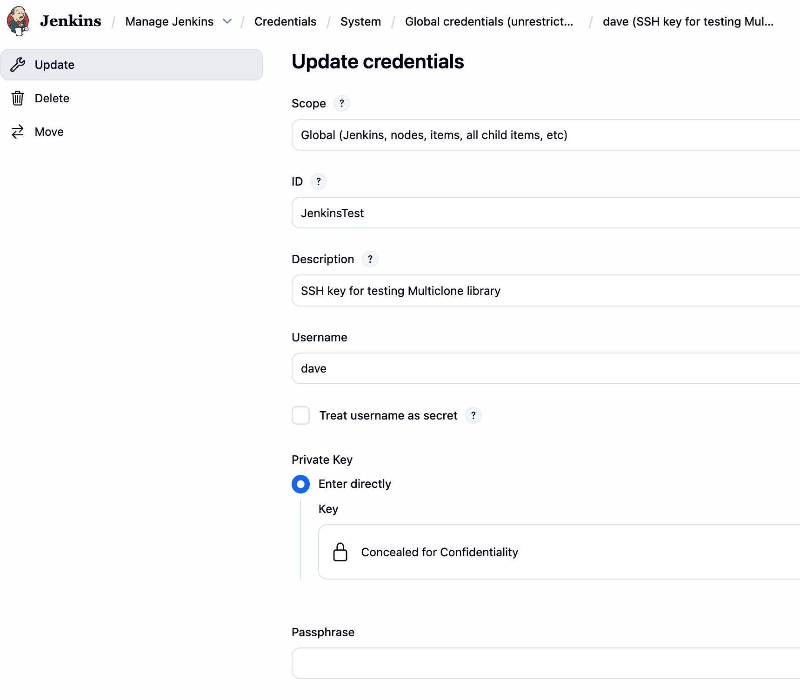

# Jenkins Multiple GitHub Checkout

## Introduction

Jenkins Multiple GitHub Checkout provides a Groovy Library for use in
your Jenkins pipelines for cloning and checking out multiple Git
repositories into your workspace.

## Requirements

* Setup a jenkins instance
* Create a new github git repo holding a shared library.
* Use the shared library from a Jenkins pipeline with one stage
* The shared lib functionality: clone from GitHub

Its arguments/capabilities:

* Clone from private repo using creds given by the Jenkins pipeline in a
  secured way
* Clone list of repos – list of URLs.

    Only in case of a list with more than 1 repo, place each one in a
    dedicated folder. In this case the folder name is the folder repo name.

## Jenkins Configuration

!!! quote annotate ""

    

!!! quote annotate ""

    

## Usage

See the [`groovydoc`](groovydoc/DefaultPackage/multiClone.html) for API details.

!!! quote annotate "Sample Jenkins Pipeline using Jenkins Multiple GitHub Checkout"

    ```groovy
    @Library('JenkinsMultipleGitHubCheckout') _

    pipeline {
        agent any

        stages {
            stage('MultiClone') {
                steps {
                     multiClone(
                        [credentialsId: "JenkinsTest",
                         repoUrls: ['https://github.com/DaverSomethingSomethingOrg/conan-system-packaging.git',
                                   'https://github.com/DaverSomethingSomethingOrg/conan-github-workflows.git'
                         ]])
                     multiClone(
                        [credentialsId: "JenkinsTest",
                         repoUrls: ['https://github.com/DaverSomethingSomethingOrg/conan-build-container.git'
                         ]])
                }
            }
        }
    }
    ```

## Documentation

### DevContainer

An Ubuntu-based DevContainer configuration is provided loaded with `groovy`,
`groovydoc`, and `mkdocs`.  The Docker file is in `.devcontainer/Dockerfile`.

### MkDocs and groovydoc

This Documentation site is generated using [`MkDocs`](https://www.mkdocs.org/).

MkDocs currently doesn't have any ability to publish Groovy docstrings
directly, and it looks like there are no plans to provide such.

- https://github.com/mkdocstrings/mkdocstrings/issues/99 - **Closed as not planned**

For now I'm simply using `groovydoc` and sending the output into the MkDocs
tree directly without formatting.

The provided script `generateDocsRelease.sh` takes care of regenerating the
`groovydoc` site under `docs/` prior to deploying the MkDocs site.
